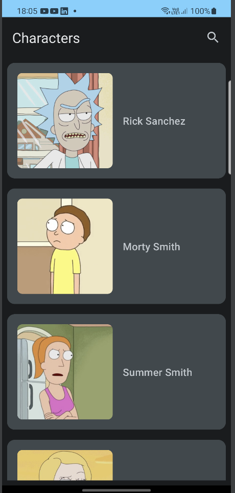
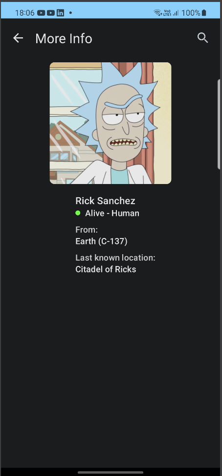
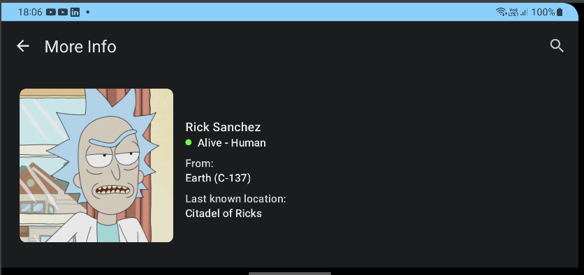
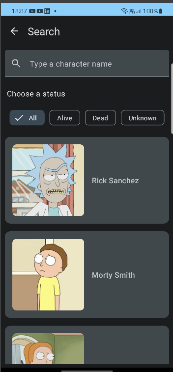

# Rick and Morty

O aplicativo Rick and Morty demonstra o desenvolvimento Android moderno utilizado Hilt, Coroutines, Flow, Jetpack (Compose, Paging 3, Room, ViewModel), baseada na arquitetura MVVM. 

## Bibliotecas e tech-stack

- Feito em [Kotlin](https://kotlinlang.org/), [Coroutines](https://github.com/Kotlin/kotlinx.coroutines) + [Flow](https://kotlin.github.io/kotlinx.coroutines/kotlinx-coroutines-core/kotlinx.coroutines.flow/): para chamadas assíncronas.
- Utiliza [Jetpack Compose](https://developer.android.com/jetpack/compose?gclid=Cj0KCQjwqs6lBhCxARIsAG8YcDihuJSbpCiQ52mO8fsWnVKiVlz22xcDV3WBOK_JRVuOv0CQHHeCqI0aAiRlEALw_wcB&gclsrc=aw.ds): um toolkit moderno para criação de telas nativas.
- [Retrofit2 & OkHttp3](https://github.com/square/retrofit): para as chamadas REST.
- [Room](https://developer.android.com/jetpack/androidx/releases/room): para persistência dos dados (offline). Provê uma camada de abstração sobre SQLite.
- [Paging 3](https://developer.android.com/topic/libraries/architecture/paging/v3-overview): biblioteca da família Jetpack que facilita o carregamento de informações e apresentação na tela, dando suporta à paginaçãoo a cache.
- [Hilt](https://dagger.dev/hilt/): para injeção de dependências.
- [Kotlin Serialization](https://kotlinlang.org/docs/serialization.html#libraries): para decodificação JSON
- Desenvolvido no [Android Studio Flamingo | 2022.2.1 Patch 2](https://developer.android.com/studio)

## Arquitetura

**Rick and Morty** se baseia na arquitetura MVVM e no Repository pattern, que segue a [Guia de arquiterura oficial do Google](https://developer.android.com/topic/architecture).
&nbsp;

### Visão geral da arquitetura

- Cada camada segue um [fluxo unidirecional de eventos/dados](https://developer.android.com/topic/architecture/ui-layer#udf); a camada de UI emite eventos para a camada de dados e esta expõe um stream de dados para as outras camadas.
- A camada de dados é projetada para funcionar independentemente de outras camadas e deve ser pura, o que significa que não possui nenhuma dependência das outras camadas.
&nbsp;

### Camada de UI

A camada se configura com elementos de UI, como telas, e interagem com o usuário e um [ViewModel](https://developer.android.com/topic/libraries/architecture/viewmodel) que guarda os estados da aplicaçào.

Com a utilização do [Jetpack Compose](https://developer.android.com/jetpack/compose?gclid=Cj0KCQjwqs6lBhCxARIsAG8YcDihuJSbpCiQ52mO8fsWnVKiVlz22xcDV3WBOK_JRVuOv0CQHHeCqI0aAiRlEALw_wcB&gclsrc=aw.ds), toda a camada visual é escrita em Kotlin, não fazendo uso do tradicional layout em XML. 
&nbsp;

### Camada de dados

A camada de dados é formada por um repositório, que realiza consultas ao dados locais (banco de dados) e requisições remotas à internet. Foi implementada para ser _offline-first_, seguindo o princípio [single source of truth](https://en.wikipedia.org/wiki/Single_source_of_truth).

&nbsp;

## Funcionalidades

A tela principal lista todos os personagens disponiveis e realiza a paginação, carregando mais dados, quando necessário.

Clicano em um personagem, é possível ver mais detalhes

Ao rotacionar a tela, a disposição das informações é alterada, para melhor visualização

É possível realizar uma busca pelo nome e status do personagem

## Considerações e decisões

- Optou-se por utilizar as últimas versões das bibliotecas do compose e material 3 atualmente disponíveis, o que implica na adição de anotações `Experimental` em partes do projeto, sendo sujeitas a mudanças futuras. Assumui-se também que este projeto não entraria em produção e foi então utilizado como um experimento das novas releases.

- O projeto utilizou o [Jetpack Compose](https://developer.android.com/jetpack/compose?gclid=Cj0KCQjwqs6lBhCxARIsAG8YcDihuJSbpCiQ52mO8fsWnVKiVlz22xcDV3WBOK_JRVuOv0CQHHeCqI0aAiRlEALw_wcB&gclsrc=aw.ds) podendo fazer uso do mais novo toolkit de desenvolvimento nativo oficial, descrevento a camada de UI puramente em Koltlin e de modo declarativo. Em um projeto de uma aplicação comercial, construir a aplicação utilizando este paradigma pode facilitar uma futura migração para [Kotlin Multiplataforma](https://kotlinlang.org/docs/multiplatform.html) se a intenção for criar aplicações para múltiplos sistemas, facilitando o reaproveitamento de código.

- Para a paginação dos dados foi utilizada a biblioteca [Paging 3](https://developer.android.com/topic/libraries/architecture/paging/v3-overview), através da implementação de um `RemoteMediator` que realiza uma integração fluida com a biblioteca [Room](https://developer.android.com/jetpack/androidx/releases/room) deixando transparente para os consumidores o fluxo de dados que automaticamente retorna somente do cache local (banco de dados) caso haja falta de conexão à internet. 

- Este projeto não possui use cases, o view model consome o flow diretamente do repositório. O motivo foi o fato do stream de dados conter a classe `PagingData`, parte da biblioteca Paging 3. Se considerarmos que a camada de domínio somente contém classes Kotlin puras, sem conhecimento de outras bibliotecas, aqui do framework Android, adicionar um use case entre a camada de dados (repositório) e de apresentação (view model), seria uma "violação" deste princípio já que o use case teria conhecimento da classse `PagingData`, adicionando uma dependência.
